# Real Estate Analysis Platform Architecture

## System Overview

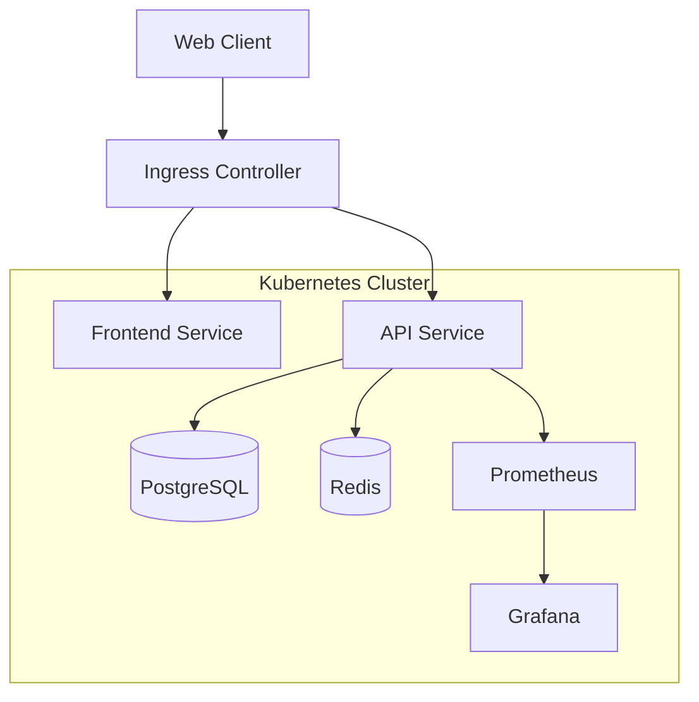

## Component Architecture

### Frontend Architecture

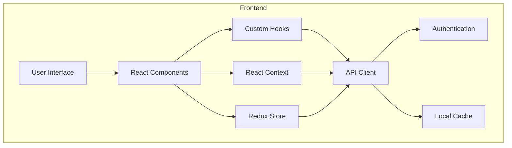

### Backend Architecture

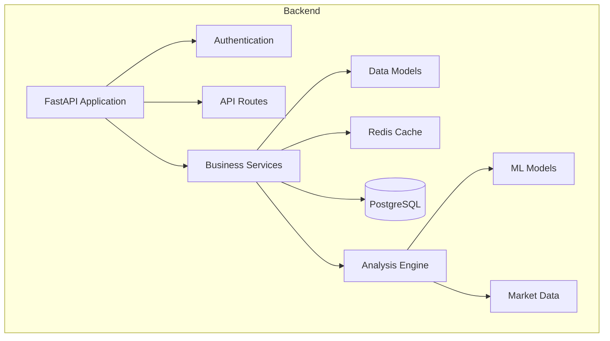

## Data Flow

### Property Analysis Flow

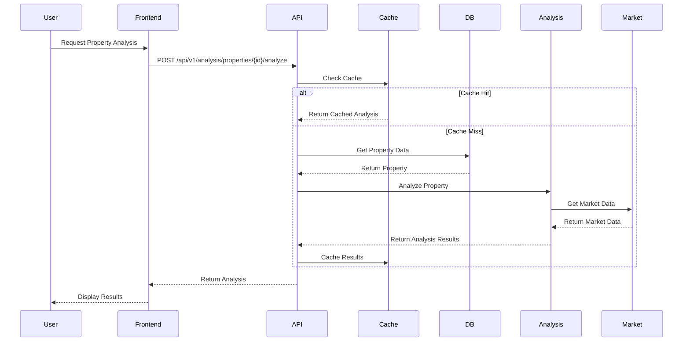

### Authentication Flow

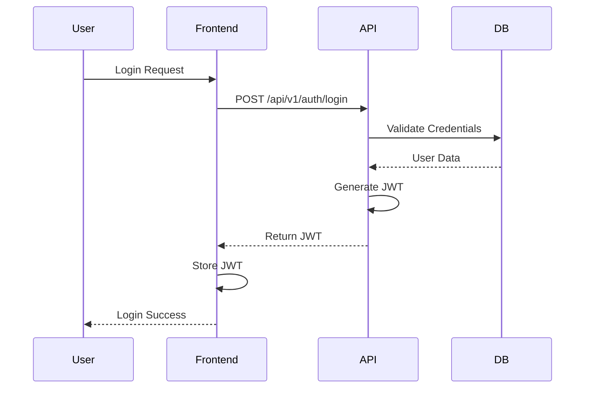

## Deployment Architecture

### Kubernetes Deployment

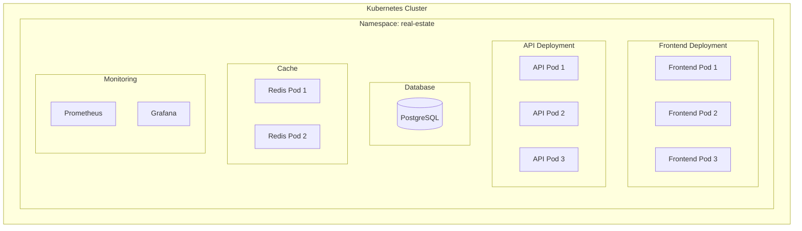

### Service Communication

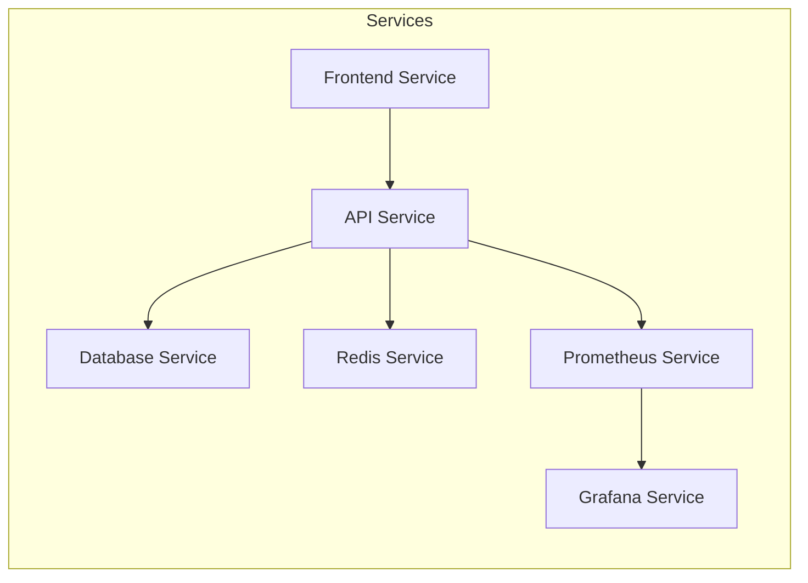

## Security Architecture

### Authentication & Authorization

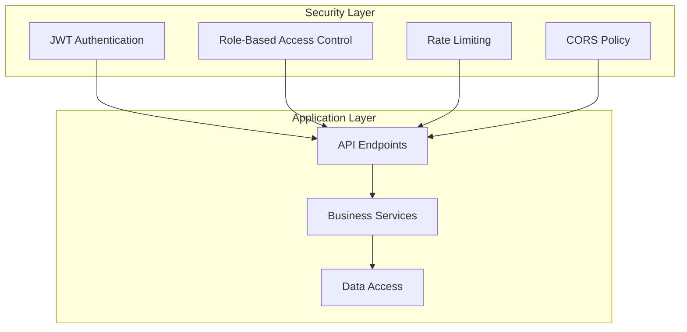

## Monitoring Architecture

### Metrics Collection

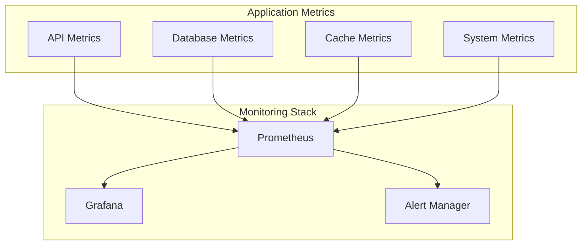

## Data Architecture

### Database Schema

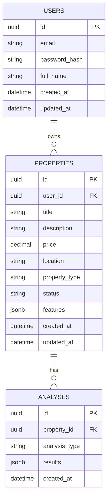

## Caching Strategy

### Cache Architecture

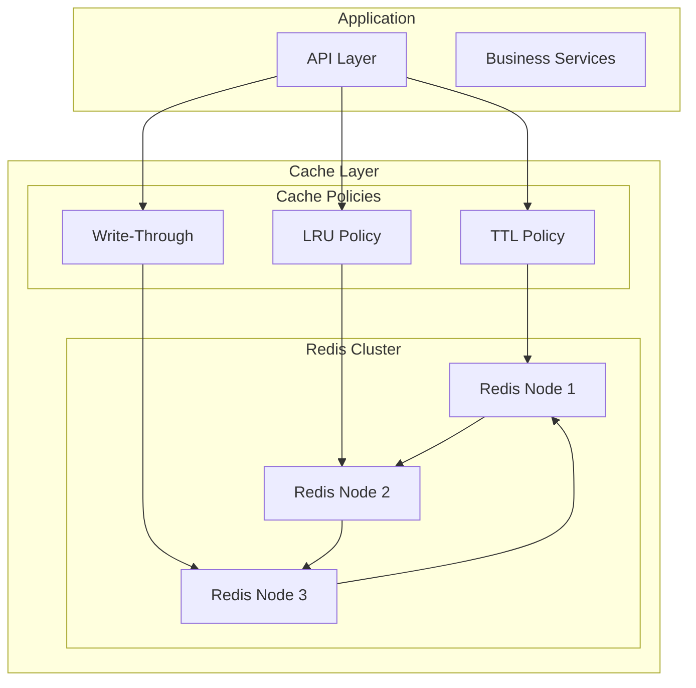

## CI/CD Pipeline

### Deployment Pipeline

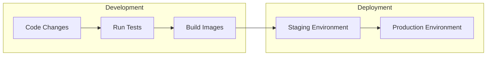

## Disaster Recovery

### Backup Strategy

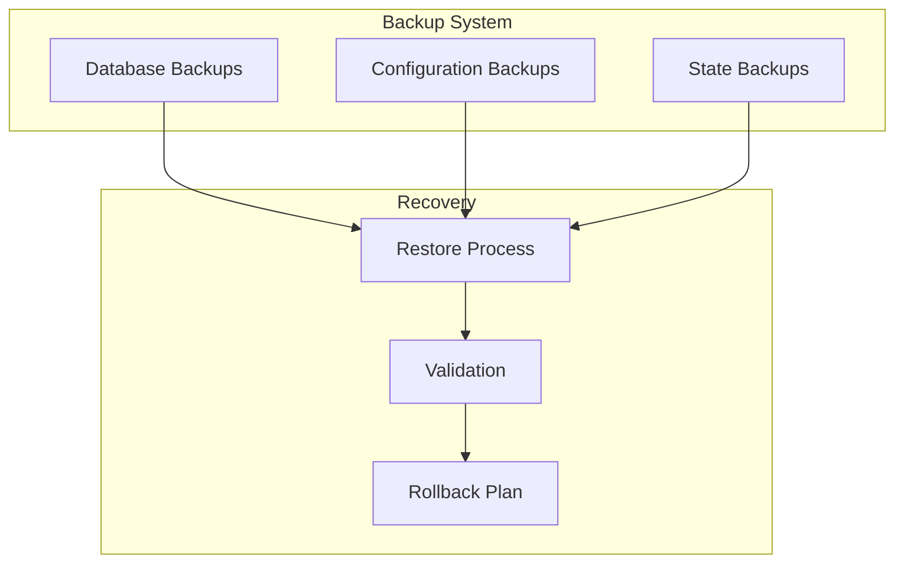